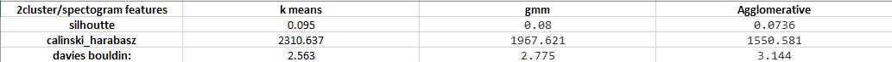

# Gender-Emotion-Recognition-From-Speech
In this project we impliment different machine learning methods to classify speech based on gender and emotion of the speakers.
 
 
 
**Data Set**:
 
We record 400 people (men and women) reading 10 different sentences in 4 emotions: sad, happy, angry, and neutral. Each audio sample has 2 labels:
 
Emotion ID: {1 : 'Angry', 2 : 'Happy', 3 : 'Sad', 4 : 'Neutral'}
 
Gender ID: {0: 'male' , 1: 'female}
 
We use the noisereduce library to remove noise from the audio samples.
 
We also shuffle and split the data set into train and test data.
 
 
 
__Feature Extraction__:
 
We frist extrat the features below using the librosa library.
 
Mel  Frequency Coefficients Cepstral (MFCC): They represent the logarithmically spaced frequency bands of the signal and capture characteristics of the audio signal relevant to human auditory perception.
 
Chroma Frequencies: They represent the twelve pitch classes in music, capturing the tonal characteristics of audio. They condense musical information by focusing on the presence of pitch classes, commonly used for tasks like chord recognition and genre classification.
 
Spectral Rolloff: It represents the frequency below which a certain percentage of the total spectral energy lies and helps characterize the high-frequency content of a signal.
 
Spectral Centroid: It indicates the "center of mass" of the frequency content in a sound spectrum and provides a measure of the average frequency and is often used to characterize the tonal center or brightness of a sound.
 
Zero Crossing: It counts the number of times the audio waveform crosses the zero amplitude axis and is used to characterize the rate of changes in the signal. 
 
After extracting the features, we use MinMaxScaler from scikit-learn to transform features to the same range.
 
 
 
__Classificatin__:
 
We employ 4 distinct classification models: MLP, KNN, SVM, and Logistic Regression. For each model, one is dedicated to gender classification, and another is assigned to emotion classification, resulting in a total of 8 models. Using cross-validation, we determine optimal hyperparameters for each model, selecting parameters based on accuracy. Following the identification of the best hyperparameters for each model, we proceed to train them on the training dataset and evaluate their performance on the test dataset.
 
 
 
__Classification Results__: 
 
 
Models accuracy:
 

 
 
Emotion classification confusion matrices
 

 
 
Gender classification matrices
 

 
 
Emotion classification ROC plot
 

 
 
Gender classification ROC plot

 
 
 
__Clustering__:
 
We apply three clustering techniques: K-means, GMM clustering, and Agglomerative clustering. For each method, we group the data into 2, 4, and 10 clusters. We evaluate the quality of the clusterings using both supervised and unsupervised criterias:
 
Supervised criteria: Homogeneity, Mutual Information 
 
Unsupervised criteria: Silhouette , Davis Bouldin
 
To visualize the clusters effectively, we employ PCA to reduce the data's dimensions to two, capturing the most significant variance.
 
 
 
__Clustering Results__:
 
 
2 cluster evaluation:
 

 
 
4 cluster evaluation:
 

 
 
10 cluster evaluation:
 

 
 
Cluster visualisation:

 

